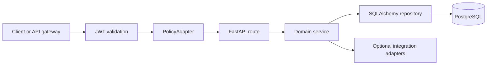

# Architecture

The service separates reusable charge behavior from the consuming application's identity, source objects, UI, and financial systems.

## Layers

- `app.api.v1`: FastAPI routes, dependency wiring, and HTTP contracts.
- `app.domain`: DTOs, rating, ranking, allocation/date/FX rules, matching, and lifecycle behavior.
- `app.db`: SQLAlchemy schema and database session management.
- `app.infrastructure`: database-backed repository/services and replaceable integration adapters.
- `alembic`: ordered schema migrations and generic seed data.

## Request Flow

JWT authentication is IdP-neutral. The default policy adapter verifies only that a principal exists; production adopters should supply authorization rules appropriate to their roles, tenants, and business scopes.

## Persistence

The HTTP runtime is database-backed. SQLAlchemy sessions provide transaction boundaries and Alembic owns schema evolution. PostgreSQL is the target runtime and uses a transaction-scoped advisory lock around repository mutations that update shared aggregate state. SQLite remains useful for fast isolated smoke tests but does not model PostgreSQL concurrency.

FX rates are queried directly from relational tables. Other lifecycle aggregates use the SQLAlchemy repository while preserving stable API IDs and restart-safe state. Repository reset is a test/administration operation and reseeds generic reference data, including the `MANUAL` FX source.

Schema sources:

- `app/db/models.py`
- `alembic/versions/`

## Reusable Domain Boundary

The API owns generic objects: charge components and aliases, allocation/date profiles, FX rates, rate books, templates, payer/payee contracts, quote requests/offers/options/commitments, charge documents, invoices, match results, and export batches.

It intentionally does not own:

- Host-application role names or user administration.
- Host-specific shipment, purchase-order, or sales-order schemas.
- UI navigation, workspace metadata, or translation policy.
- ERP-specific posting objects or ledger mappings.
- Customer-specific authorization and tenant policy.

## Extension Points

- `PolicyAdapter`: action authorization and tenant/row-scope enforcement.
- `SourceObjectHydrator`: optional host-object hydration.
- `FinancialExportAdapter`: ERP, ledger, billing, or event export.
- Document storage can be connected at the consuming application boundary.

Adapters should translate external concepts into the neutral API contract rather than adding product-specific names to the core schema.
