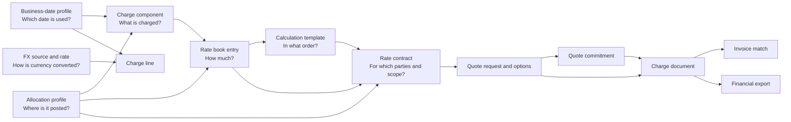

# Core Concepts And Module Guide

This guide explains what each charge-management module represents, when to use it, and how the modules work together. Endpoint paths below are relative to `/api/v1/charge-management` and require bearer authentication.

## Mental Model

The simplest way to remember the boundary is:

| Question | Module |
| --- | --- |
| What kind of amount is this? | Charge component |
| How much should be charged? | Rate book / rate table |
| Which charge steps should run? | Calculation template |
| Which commercial agreement applies? | Rate contract |
| Where should the amount be distributed or posted? | Allocation profile |
| Which operational date selects the FX rate? | Business-date profile |
| Which exchange rate converts the amount? | FX source and FX rate |
| Which price or provider option should be selected? | Quote lifecycle |
| What amount is expected, approved, exported, and matched? | Charge document and invoice |

## Recommended Setup Order

1. Review seeded charge components and create any missing components.
2. Create and publish allocation profiles used by those components or rates.
3. Create and publish business-date profiles, then assign them to applicable scopes.
4. Configure component defaults and optional component aliases.
5. Maintain FX sources and directional FX rates.
6. Create rate books and their rate entries.
7. Create calculation templates when rating needs ordered multi-component logic.
8. Create payer/payee contracts, attach rate books or templates, and release the contracts.
9. Create direct charge documents or run the quote lifecycle.
10. Capture invoices, match them, approve the charge document, and export it.

You do not need every module for every integration. A direct-charge implementation can start with components, optional allocation/date/FX setup, and charge documents. Contract-based quotation needs the pricing and quote modules as well.

## Current Execution Boundary

The API separates maintained business configuration from executable built-in behavior. Rate-book matching, basis calculation, quote ranking/award, date resolution, FX resolution, allocation-policy snapshots, document lifecycle, and invoice matching are executable today.

Calculation templates currently persist an ordered, reusable calculation definition, but the built-in contract rater does not yet execute template steps, subtotal expressions, statistical behavior, or precondition rules. An integrating calculation engine can consume that metadata; for built-in contract rating, each contract line must resolve to a rate book.

## Charge Component

### What It Is

A charge component is the canonical definition of a charge type, such as freight, documentation, handling, fuel surcharge, customs fee, or tax. It answers **what the amount means**, not how much the amount is.

Examples:

- `OCEAN_FREIGHT`
- `FUEL_SURCHARGE`
- `TERMINAL_HANDLING`
- `DOCUMENTATION_FEE`

### What It Controls

- Stable `component_code` and readable name.
- Category and transport/business context.
- Whether the amount normally belongs to the payer, payee, or both sides.
- Default calculation basis.
- Default charge-date behavior.
- Optional business-date and allocation profile references.
- Tax and active flags.

### How To Use It

1. List seeded components with `GET /components`.
2. Create a missing component with `POST /components`.
3. Update defaults with `PUT /components/{id}`.
4. Soft-deactivate a component with `DELETE /components/{id}`.
5. Reference `component_code` from rate entries, template steps, contract lines, quote lines, charge lines, and invoice lines.

Use a component code as a durable semantic identifier. Do not create a new component merely because a customer has a different price; put that variation in a rate book or contract.

## Charge Component Alias

### What It Is

An alias maps an external or imported label to a canonical charge component. For example, `THC`, `Terminal Handling`, and `Origin terminal fee` can all map to the same component.

### When To Use It

- Importing provider proposals or rate sheets.
- Normalizing invoice labels.
- Supporting customer-, forwarder-, transport-mode-, template-, or document-specific terminology.
- Overriding default allocation behavior for a recognized external label.

### How To Use It

1. Create the canonical component first.
2. Create an alias with `POST /component-aliases` using `raw_label` and `charge_component_id`.
3. Add optional customer, forwarder, transport mode, document kind, or template scope.
4. Choose `INHERIT_PROFILE`, `OVERRIDE_PROFILE`, or `NO_ALLOCATION` for allocation behavior.
5. Search aliases with `GET /component-aliases` and update/deactivate them through the ID endpoint.

Aliases normalize input; they are not separate charge types and they do not replace rate books.

## Rate Book And Rate Table

### What It Is

The API term is **rate book**. A rate book is a named collection of **rate book entries**, and those entries are the rate table rows.

Each entry connects a charge component to an amount and optional applicability conditions:

- Currency and calculation basis.
- Origin and destination.
- Transport mode and equipment type.
- Commodity and service level.
- Scale range, minimum, and maximum.
- Validity dates.
- Optional allocation profile/version.

### Example

A rate book named `EU_OCEAN_2026` could contain:

| Component | Origin | Destination | Equipment | Rate | Basis |
| --- | --- | --- | --- | ---: | --- |
| `OCEAN_FREIGHT` | `ESBCN` | `USNYC` | `40HC` | 2,500 USD | `CONTAINER` |
| `DOCUMENTATION_FEE` | `ESBCN` | `USNYC` | Any | 75 USD | `SHIPMENT` |

### How To Use It

1. Create a rate book and its entries with `POST /rate-books`.
2. Find books through `GET /rate-books`.
3. Open the full book with `GET /rate-books/{id}/workspace`.
4. Replace/update workspace data with `PUT /rate-books/{id}/workspace`.
5. Reference the rate book from a contract header, contract line, or calculation-template step.

A rate book defines reusable prices. A contract determines the parties and commercial scope under which those prices apply.

## Calculation Template

### What It Is

A calculation template is an ordered, reusable definition of charge calculation steps. It describes **which components an integrating calculation engine should evaluate and in what sequence**.

A step can define:

- Sequence number.
- Charge component.
- Payer/payee relationship role.
- Optional rate book.
- Optional subtotal key.
- Statistical-only behavior.
- Optional precondition key for an integrating rule layer.

### When To Use It

- An integrating calculation engine needs a reusable multi-component definition.
- Different steps should reference different rate books.
- The intended order of base charges, surcharges, subtotals, or statistical rows must be persisted and audited.
- You need calculation metadata that can be attached to multiple contracts.

### How To Use It

1. Create rate books and components first.
2. Create the template with `POST /calculation-templates`.
3. List/search with `GET /calculation-templates`.
4. Open or update it through `/calculation-templates/{id}/workspace`.
5. Reference it as the default on a contract or as an override on a contract line.

The template stores the intended orchestration and the rate book supplies monetary rates. The current built-in contract rater does not execute template steps: it rates contract lines that resolve directly to a rate book. Treat template execution as an extension point until an execution engine is added.

## Rate Contract

### What It Is

A rate contract binds prices to a commercial relationship and applicability scope. A contract has role `PAYER` or `PAYEE`:

- `PAYER`: provider-cost or payable-side agreement.
- `PAYEE`: customer-pricing or receivable-side agreement.

The names describe the line relationship in the charge model, not hardcoded accounting roles in a host system.

### What It Contains

- Party references and optional neutral scope IDs.
- Currency and validity period.
- Default rate book and calculation template.
- Contract lines that narrow applicability by lane, mode, equipment, commodity, service level, or dates.
- Optional line-level overrides for rate book, template, and allocation profile.

### Lifecycle And Use

1. Create a draft with `POST /contracts`.
2. Find it with `GET /contracts`.
3. Inspect and edit it through `/contracts/{id}/workspace`.
4. Add at least one contract line.
5. Ensure a header or line references a rate book or calculation template.
6. Release with `POST /contracts/{id}/release`.
7. Released matching contracts become candidates during quote contract determination and rating.

Use contracts for negotiated applicability and party context. Do not place customer-specific scope directly in a shared rate book unless that rate book is intentionally customer-specific.

## Allocation Profile And Allocation Basis

### What It Is

An allocation profile describes how a charge originating at one logistics level should move to a final posting level.

The key distinction is:

- **Allocation basis/driver:** the measure used to distribute an amount, such as weight, volume, quantity, value, or container count.
- **Allocation profile:** the versioned policy that combines source level, one or two drivers, final posting level, quantity UOM, and settings.

### Two-Stage Allocation

The profile can describe:

1. `source_level`: where the original charge exists, such as shipment, container, or house.
2. `source_to_house_driver`: how shipment/container value reaches house level.
3. `house_to_item_driver`: how house value reaches item or PO schedule-line level.
4. `final_posting_level`: `HOUSE` or `PO_SCHEDULE_LINE`.

Example: allocate a shipment charge to houses by gross weight, then to PO schedule lines by item value.

### Lifecycle And Use

1. Create a profile and initial draft version with `POST /allocation-profiles`.
2. Edit the draft version with `PUT /allocation-profile-versions/{version_id}`.
3. Publish it with `POST /allocation-profile-versions/{version_id}/publish`.
4. Reference the published profile/version from a component, rate entry, contract line, alias override, or charge line.
5. Create a new version for later changes; published versions are immutable.

### Resolution Precedence

The effective profile is resolved from the most specific available reference, including transaction/line override before reusable master-data defaults. The selected profile and version are snapshotted onto quote and charge lines for auditability.

The current API resolves and persists allocation policy, target references, ratios, and driver values. It does not hydrate a host application's shipment/house/item hierarchy or independently fan one source amount into target rows. The integrating application supplies target objects and calculated ratios/driver values when it creates posting lines.

## Business-Date Profile And Date Driver

### What It Is

A business-date profile is an ordered fallback chain used to find the date for a business purpose, currently `EXCHANGE_RATE_DATE`.

The key distinction is:

- **Date driver/date key:** one candidate operational date, such as actual departure, planned departure, document date, or manual line date.
- **Business-date profile:** a versioned ordered list of those keys.

Example fallback chain:

1. Shipment actual departure date.
2. Shipment planned departure date.
3. Document date.

The first available date wins.

### Component Policy Modes

- `LEGACY_BASIS`: use the component's single `charge_date_basis` mapping.
- `INHERIT_PROFILE`: select a published profile through the document's scoped assignment.
- `PROFILE_OVERRIDE`: always use a specific published profile attached to the component.

### Lifecycle And Use

1. Read supported date keys from `GET /initialization-data`.
2. Create a profile and draft steps with `POST /business-date-profiles`.
3. Edit the draft version, then publish it.
4. Optionally assign it by scope, shipment scope, and purpose through `/business-date-profiles/{id}/assignments`.
5. Set components to `INHERIT_PROFILE` or `PROFILE_OVERRIDE` as required.
6. Supply `document_date`, `charge_date`, and operational dates in `source_reference_snapshot_json` or target snapshots when creating the charge document.

Resolution precedence is explicit `exchange_rate_date`, manual line `charge_date`, line date-basis override, component profile/assignment/legacy policy, then document fallback.

An assignment can be global or scoped to company, customer, vendor, forwarder, or carrier. `shipment_scope` distinguishes `OCEAN_HOUSE` and `AIR_HOUSE`. Only one effective assignment can own the same scope, shipment scope, and purpose slot.

## FX Rate Source And FX Rate

### What It Is

An FX source identifies where rates came from, such as a central bank, treasury feed, commercial provider, or manual maintenance process. An FX rate is a dated directional rate published by that source.

The stored convention is:

> target-currency units for one source-currency unit

Therefore, an `EUR -> USD` rate of `1.15` converts EUR 100 to USD 115.

### How To Use It

1. Use the seeded `MANUAL` source or create one with `POST /fx-rate-sources`.
2. Create directional rates with `POST /fx-rates`.
3. Search maintained rates with `GET /fx-rates`.
4. Resolve a conversion with `POST /fx-rates/resolve`.
5. Persist the selected rate ID, source, type, method, rate, and date on the charge line.
6. Soft-deactivate obsolete sources/rates with their `DELETE` endpoints.

Resolution can require an exact date or allow the latest prior date. It can also allow an inverse pair. `conversion_method` defaults to `DIRECT`, which prevents ambiguous selection if multiple methods exist for the same pair/date/source.

The business-date profile chooses the date; the FX resolver chooses the rate for that date.

## Quote Request

### What It Is

A quote request is the demand or RFQ context to price. It can carry lane, transport mode, equipment, service level, commercial scope, quantity, containers, packages, weight, volume, requested date, validity, expiry, and host-application context.

### Lifecycle And Use

1. Create a `DRAFT` with `POST /quote-requests`.
2. Find it later with `GET /quote-requests`.
3. Edit the draft through `PUT /quote-requests/{id}/workspace`.
4. Submit it by changing status from `DRAFT` to `REQUESTED` through that workspace endpoint.
5. Determine matching released contracts, submit provider offers, or rate from contracts.
6. Rank generated options.
7. Award one option.

The workspace endpoint returns the request together with offers, options, commitments, and linked charge documents, allowing a client to resume after refresh.

## Quote Offer, Quote Option, And Ranking

### Difference Between Offer And Option

- **Quote offer:** an external/provider-submitted commercial proposal against an RFQ.
- **Quote option:** the API's normalized, comparable pricing result. It may be created from an offer or from released contracts and rate books.

An option contains payer/payee totals, margin, service information, score, rank, component lines, source contracts, and source rate books.

### How To Use It

1. Submit a provider offer with `POST /quote-requests/{id}/offers`, or call `POST /quote-requests/{id}/rate` to produce contract-based options.
2. Optionally inspect matches with `POST /quote-requests/{id}/determine-contracts`.
3. Rank with `POST /quote-requests/{id}/rank`.
4. Award with `POST /quote-requests/{id}/award` and the chosen `quote_option_id`.

Award creates a charge document and, when applicable, a quote commitment. `quotation_policy` controls whether quotation is required, optional, or disabled in favor of direct charge documents.

## Quote Commitment

### What It Is

A quote commitment is the reusable awarded capacity and value that can later be consumed by execution objects such as bookings or shipments.

It tracks committed, consumed, and remaining:

- Container count.
- Package count.
- Chargeable weight.
- Generic quantity.
- Monetary amount.

### How To Use It

1. Award a quote option to create the commitment.
2. Find an applicable active commitment with `POST /quote-commitments/match`.
3. Consume part or all of it with `POST /quote-commitments/{id}/consume`.
4. Reverse an incorrect/cancelled consumption with `POST /quote-commitment-consumptions/{id}/reverse`.
5. Inspect consumption history through the quote request workspace.

The API stores neutral source-object type/ID references; it does not prescribe the host application's booking or shipment schema.

## Charge Document And Charge Line

### What It Is

A charge document is the durable financial/operational record of expected charges. It can be created directly or generated when a quote option is awarded.

A charge line records one component amount and its audit context:

- Payer/payee relationship.
- Expected, actual, and approved amounts.
- Source and target currency with selected FX snapshot.
- Business date and date-basis decision.
- Allocation profile, target, ratio, and driver snapshot.
- Source contract/rate or quote lineage.
- Calculation audit JSON.

`POSTING` lines count toward totals. `CALCULATION` lines can retain intermediate/audit rows without changing commercial totals.

### Lifecycle And Use

1. Create directly with `POST /charge-documents` or award a quote.
2. Find documents with `GET /charge-documents`.
3. Open/update through `/charge-documents/{id}/workspace` while editable.
4. Capture and match related invoices.
5. Approve with `POST /charge-documents/{id}/approve`.
6. Export with `POST /charge-documents/{id}/post-export`.
7. Reverse an approved/exported document with `POST /charge-documents/{id}/reverse`.

Quote-controlled lines remain tied to the awarded outcome. Direct-document lines can be replaced while the document remains editable and before downstream lifecycle locks apply.

## Invoice And Matching

### What It Is

An invoice records actual supplier or customer charges against a charge document. Matching compares invoice lines to expected charge lines by `charge_component_code`.

### Match Results

- `MATCHED`: invoice and expected amount differ by no more than `0.01`.
- `VARIANCE`: the component exists but the amount differs.
- `UNEXPECTED`: the invoice component does not exist on the charge document.

### How To Use It

1. Create an invoice with `POST /invoices` and its related `charge_document_id`.
2. Find invoices with `GET /invoices`.
3. Inspect or correct it through `/invoices/{id}/workspace`.
4. Run `POST /invoices/{id}/match`.
5. Review per-component expected, invoice, variance amount, variance percentage, and status.

Updating an invoice clears stale match results and returns it to `CAPTURED` so it can be matched again.

## Approval, Export, And Reversal

### Approval

Approval moves the charge document to `APPROVED` and copies each line's actual amount, or expected amount when actual is absent, into `approved_amount`.

### Export

Export requires an approved document. The default endpoint creates an export number, marks the document as exported, stores the result in the configured repository, and returns an `INTERNAL_LEDGER` JSON payload. The codebase declares a `FinancialExportAdapter` extension seam, but it is not wired into the default service. Integrators must wire that adapter or replace the service composition before assuming a payload is sent to a ledger, ERP, billing system, or event bus.

### Reversal

Only approved or exported documents can be reversed. Reversal preserves the document and records status, timestamp, and reason rather than deleting financial history.

## Common Misunderstandings

| Misunderstanding | Correct interpretation |
| --- | --- |
| A component contains the customer price. | A component defines meaning; rate books/contracts define price. |
| A rate table and rate book are different modules. | A rate book is the table header; rate book entries are its rows. |
| Allocation basis and allocation profile are synonyms. | A basis is one driver; a profile is the versioned end-to-end allocation policy. |
| A date driver is an FX rate. | A date driver selects the date; FX resolution selects the rate. |
| A provider offer is already the awarded charge. | The offer becomes a comparable option; award creates the charge document/commitment. |
| A quote commitment is a shipment. | It is neutral awarded capacity/value that a shipment or other host object can consume. |
| Invoice matching changes the expected rate. | Matching compares actual invoice values against the persisted expected charge lines. |

## Next Guides

- [API examples](api-examples.md) provides runnable allocation, date, and FX requests.
- [Database](database.md) maps concepts to relational tables.
- [Authentication](authentication.md) explains JWT and the authorization adapter boundary.
- [Generated OpenAPI](../app/contracts/charge-management-api.openapi.json) contains every request and response schema.
