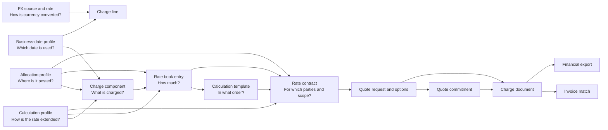

# Core Concepts And Module Guide

This guide explains what each charge-management module represents, when to use it, and how the modules work together. Endpoint paths below are relative to `/api/v1/charge-management` and require bearer authentication.

## Mental Model

```mermaid
flowchart LR
    C["Charge component\nWhat is charged?"] --> R["Rate book entry\nHow much?"]
    P["Calculation profile\nHow is the rate extended?"] --> C
    P --> R
    P --> K
    R --> T["Calculation template\nIn what order?"]
    R --> K["Rate contract\nFor which parties and scope?"]
    T --> K
    A["Allocation profile\nWhere is it posted?"] --> C
    A --> R
    A --> K
    D["Business-date profile\nWhich date is used?"] --> C
    F["FX source and rate\nHow is currency converted?"] --> L["Charge line"]
    D --> L
    K --> Q["Quote request and options"]
    Q --> M["Quote commitment"]
    Q --> X["Charge document"]
    M --> X
    X --> I["Invoice match"]
    X --> E["Financial export"]
```

The simplest way to remember the boundary is:

| Question | Module |
| --- | --- |
| What kind of amount is this? | Charge component |
| How much should be charged? | Rate book / rate table |
| How should a unit rate become a total amount? | Calculation profile |
| Which charge steps should run? | Calculation template |
| Which commercial agreement applies? | Rate contract |
| Where should the amount be distributed or posted? | Allocation profile |
| Which operational date selects the FX rate? | Business-date profile |
| Which exchange rate converts the amount? | FX source and FX rate |
| Which price or provider option should be selected? | Quote lifecycle |
| What amount is expected, approved, exported, and matched? | Charge document and invoice |

## Recommended Setup Order

1. Review seeded charge components and create any missing components.
2. Create and publish calculation profiles for single- or multi-axis rate extension.
3. Create and publish allocation profiles used by those components or rates.
4. Create and publish business-date profiles, then assign them to applicable scopes.
5. Configure component defaults and optional component aliases.
6. Maintain FX sources and directional FX rates.
7. Create rate books and their rate entries.
8. Create calculation templates when rating needs ordered multi-component logic.
9. Create payer/payee contracts, attach rate books or templates, and release the contracts.
10. Create direct charge documents or run the quote lifecycle.
11. Capture invoices, match them, approve the charge document, and export it.

You do not need every module for every integration. A direct-charge implementation can start with components, optional allocation/date/FX setup, and charge documents. Contract-based quotation needs the pricing and quote modules as well.

For road transport, start with the seeded road component and profile pack described in [Road freight metadata](road-freight-metadata.md). It documents which operational values the caller must supply for distance, stop, pallet, loading-meter, time, and business-date calculations.

## Current Execution Boundary

Invoice matching and financial export use only `POSTING` lines. `CALCULATION` rows remain in document workspaces to explain allocation lineage; they are excluded from `post-export`'s `payload_json.lines`. The response's `document.lines` still contains the complete hierarchy. For example, a 100 calculation source allocated to 40 and 60 produces a ledger payload totaling 100.

Automatic document and quote numbers use persisted counters. Deleting an earlier or latest document does not reset the sequence, including after a repository reload. These are identifiers, not gap-free accounting sequences.

The API separates maintained business configuration from executable built-in behavior. Rate-book matching and versioning, calculation-profile and calculation-template execution, quote ranking/award, date resolution, FX resolution, allocation preview, document lifecycle, and invoice matching are executable today.

`POST /calculations/preview` is the reusable, side-effect-free entry point when a host application needs a calculated result without creating a quote or charge document. It supports flat and quantity-based rates, percentages with an explicit base, published calculation-profile versions, minimum/maximum amounts, currency conversion, and allocation over caller-supplied targets. The host application still owns source-object hydration and authorization of those targets.

## Charge Component

### What It Is

A charge component is the canonical definition of a charge type, such as freight, documentation, handling, fuel surcharge, customs fee, or tax. It answers **what the amount means**, not how much the amount is.

Examples:

- `OCEAN_FREIGHT`
- `FUEL_SURCHARGE`
- `TERMINAL_HANDLING`
- `DOCUMENTATION_FEE`

### What It Controls

- Stable `component_code` and readable name.
- Category and transport/business context.
- Whether the amount normally belongs to the payer, payee, or both sides.
- Default calculation basis.
- Optional default calculation profile.
- Default charge-date behavior.
- Optional business-date and allocation profile references.
- Tax and active flags.

Category is classification metadata for cataloging and reporting. Charge context is an applicability dimension: `DESTINATION`, for example, identifies import/arrival-side charges. The tax flag classifies a component for reporting and downstream tax handling; it does not calculate a tax amount by itself.

### How To Use It

1. List seeded components with `GET /components`.
2. Create a missing component with `POST /components`.
3. Update defaults with `PUT /components/{id}`.
4. Soft-deactivate a component with `DELETE /components/{id}`.
5. Reference `component_code` from rate entries, template steps, contract lines, quote lines, charge lines, and invoice lines.

Use a component code as a durable semantic identifier. Do not create a new component merely because a customer has a different price; put that variation in a rate book or contract.

## Charge Component Alias

### What It Is

An alias maps an external or imported label to a canonical charge component. For example, `THC`, `Terminal Handling`, and `Origin terminal fee` can all map to the same component.

### When To Use It

- Importing provider proposals or rate sheets.
- Normalizing invoice labels.
- Supporting customer-, forwarder-, transport-mode-, source-UOM-, template-, or document-specific terminology.
- Overriding default calculation or allocation behavior for a recognized external label.

### How To Use It

1. Create the canonical component first.
2. Create an alias with `POST /component-aliases` using `raw_label` and `charge_component_id`.
3. Add optional customer, forwarder, transport mode, source UOM, document kind, or template scope. Source UOM is part of alias identity, so the same label can have separate document, container, ocean W/M, weight, or percentage behavior.
4. Choose `INHERIT_PROFILE`, `OVERRIDE_PROFILE`, or `NO_PROFILE` for calculation behavior and optionally select the calculation profile.
5. Choose `INHERIT_PROFILE`, `OVERRIDE_PROFILE`, or `NO_ALLOCATION` for allocation behavior and optionally select the allocation profile.
6. Search aliases with `GET /component-aliases` and update/deactivate them through the ID endpoint.

Aliases normalize input; they are not separate charge types and they do not replace rate books.

## Rate Book And Rate Table

### What It Is

The API term is **rate book**. A rate book is a versioned price table for exactly one charge component. Its **rate book entries** are the table rows. The component is fixed on the header; rows vary the price and only the applicability or override columns selected in `row_attribute_keys`.

Each entry connects the header component to an amount and optional applicability conditions:

- Fixed `rate_amount` or percentage `rate_percent`, currency, and an inherited or overridden calculation basis.
- Inherited or overridden charge context.
- Origin and destination.
- Transport mode and equipment type.
- Commodity and service level.
- Scale range, minimum, and maximum.
- Validity dates.
- Priority and active state.
- Optional allocation profile/version.
- Optional calculation profile, which overrides the component default for that rate row.

### Example

A rate book named `EU_OCEAN_FREIGHT_2026` for component `OCEAN_FREIGHT` could contain:

| Origin | Destination | Equipment | Service level | Rate |
| --- | --- | --- | --- | ---: |
| `ESBCN` | `USNYC` | `40HC` | `STANDARD` | 2,500 USD |
| `ESBCN` | `USNYC` | `40HC` | `EXPRESS` | 2,900 USD |

Create a separate `EU_DOCUMENTATION_2026` rate book for `DOCUMENTATION_FEE`. A calculation template can then combine the freight and documentation books in one ordered calculation.

### Row Schema

`row_attribute_keys` is the controlled built-in table schema shared by every row in a rate-book version. Supported optional columns are:

`origin_code`, `destination_code`, `mode`, `equipment_type`, `commodity_code`, `service_level`, `scale_from`, `scale_to`, `minimum_amount`, `maximum_amount`, `validity_from`, `validity_to`, `basis_override`, `charge_context_override`, `calculation_profile_id`, `allocation_profile_id`, and `priority`.

Rate value, currency, component, and active state are core row fields and do not need to appear in `row_attribute_keys`. The API rejects row values outside the selected schema so a hidden stale value cannot affect matching unexpectedly. Legacy books with one component are inferred on read; new books must send `charge_component_code` explicitly.

`dimension_codes` extends that schema with canonical custom pricing dimensions maintained by LedgerFlow. Each row stores its selected values in `dimension_values`; each quote carries its normalized values under the same canonical codes. Caller-specific field names never become rate-book columns directly. Use a caller mapping profile to translate each caller/schema contract into this shared vocabulary. See [Caller attribute mapping](caller-attribute-mapping.md) for the two supported calling modes and lifecycle rules.

### How To Use It

1. Choose one charge component and create a rate book with `charge_component_code`, `row_attribute_keys`, and entries through `POST /rate-books`.
2. Find books through `GET /rate-books`.
3. Open the full book with `GET /rate-books/{id}/workspace`.
4. Edit a draft through `PUT /rate-books/{id}/workspace`, passing `expected_lock_version` for optimistic concurrency.
5. Publish the draft with `POST /rate-books/{id}/publish`; the previously published version is retired.
6. Create the next draft with `POST /rate-books/{id}/versions` and inspect history with `GET /rate-books/{id}/versions`.
7. Reference the published rate-book version from a contract header, contract line, or calculation-template step.

When a row omits `basis_override` or `charge_context_override`, the API resolves the value from its component. The response stores that effective snapshot in `basis` and `charge_context`, while the override fields remain null. This makes a published version reproducible if a component default later changes. Rows created before migration `0022` retain their previously required row basis as an explicit `basis_override` for the same compatibility reason.

The built-in rater selects at most one rate entry for each applicable contract line. It first removes inactive, out-of-date, out-of-scale, context-mismatched, and dimension-mismatched rows. Quote context defaults to `TRANSPORT`; callers should explicitly send another value for origin-, destination-, tax-, or other context-specific pricing. The rater then chooses the most specific row, followed by the lowest numeric priority, the highest matching `scale_from`, and finally the stable row ID. This makes overlapping rate-table rows deterministic. Header `valid_from`/`valid_to` and `is_active` are applied before entry selection; entry date fields retain the API names `validity_from`/`validity_to` for backward compatibility.

Use basis `PERCENT` with `rate_percent`. A percentage always needs an explicit monetary base: a template percentage step uses its named prior subtotal, while a direct quote context uses `percentage_base_amount` or a component-specific entry in `percentage_bases`. The API rejects a percentage with no base rather than calculating against an implicit value. Use `rate_amount` for fixed and quantity-based rows. `CHARGEABLE_WEIGHT` uses quote `chargeable_weight` for rating.

A rate book defines reusable prices. A contract determines the parties and commercial scope under which those prices apply. Draft versions are editable; published and retired versions are immutable so historical quote and charge provenance remains reproducible.

## Calculation Profile

### What It Is

A calculation profile is a versioned formula that turns a unit rate into a source charge amount. It is optional on every component: simple flat charges can use the seeded flat profile, while compound charges can multiply the rate by several independent axes.

For example, a container storage rate can use:

`unit rate x eligible container count x duration hours`

With a rate of `12`, three eligible containers, and eight entered hours, the calculated amount is `288`.

### Factors And Trust Boundary

Each ordered factor has a resolver. Object-derived resolvers such as container count, House count, quantity, weight, volume, chargeable weight, and ocean weight-or-measure come from the persisted source-object context. Ocean W/M is the greater of metric tonnes and cubic metres. A line request cannot replace those values. Transaction resolvers such as manual quantity and duration can be entered for the specific charge.

`PERCENT_OF_REFERENCE` calculates `reference amount x percentage / 100`. The reference amount must be explicit in calculation input or context; it is never inferred from an unrelated charge. Rate minimum and maximum boundaries are applied after the formula.

Missing required factors block calculation; the engine does not silently substitute an equal share or a value of one.

### Lifecycle, Resolution, And Audit

1. Create a profile and initial draft version with `POST /calculation-profiles`.
2. Edit the draft through `PUT /calculation-profile-versions/{version_id}`.
3. Publish it through `POST /calculation-profile-versions/{version_id}/publish`.
4. Assign the profile as a component default or as an override on a rate-book entry or contract line.
5. For a direct charge line, explicitly pin a published profile version when the component default is not appropriate.

Published versions are immutable. Contract-line profile takes precedence over rate-book-entry profile, which takes precedence over component default. A direct line's explicit published version takes precedence over its component default. The effective version, factor values, and calculation configuration are snapshotted on quote-option and charge-document lines.

Calculation and allocation are separate stages: calculation creates one source amount first, then allocation propagates that amount without recalculating it.

## Calculation Template

### What It Is

A calculation template is an ordered, reusable definition of charge calculation steps. It describes **which components the contract rater evaluates and in what sequence**.

A step can define:

- Sequence number.
- Charge component.
- Payer/payee relationship role.
- Optional rate book.
- Optional subtotal key.
- Whether the calculated result is added to that subtotal.
- Statistical-only behavior.
- Optional precondition key resolved from boolean-like quote context.

### When To Use It

- Contract rating needs a reusable multi-component definition.
- Different steps should reference different rate books.
- The intended order of base charges, surcharges, subtotals, or statistical rows must be persisted and audited.
- You need calculation metadata that can be attached to multiple contracts.

### How To Use It

1. Create rate books and components first.
2. Create the initial draft template with `POST /calculation-templates`.
3. List/search with `GET /calculation-templates`.
4. Open or update a draft through `/calculation-templates/{id}/workspace`, using `expected_lock_version` when editing.
5. Publish with `POST /calculation-templates/{id}/publish`. The prior published version in the family is retired.
6. Create a later draft with `POST /calculation-templates/{id}/versions` and inspect history with `GET /calculation-templates/{id}/versions`.
7. Reference a published template as the default on a contract or as an override on a contract line.

Every step that pins a rate book must use the same charge component as that book. Draft templates may be edited; published and retired versions are immutable. Contract release and runtime rating accept published templates only.

The built-in contract rater expands template steps in order, filters them by relationship role and precondition, resolves each step's rate book, and carries named subtotals into later percentage steps. Multiple steps may share a subtotal key; each percentage step reads the subtotal's current accumulated amount. Set `accumulate_result_in_subtotal` to `false` when a commercial percentage line should read that base without changing it for later percentage steps. The flag defaults to `true`, so existing templates retain their behavior. Statistical steps are different: they remain visible for provenance but do not contribute to payer/payee totals or named subtotals. Every resulting option line records the source contract, rate-book version, and exact rate-book entry.

## Rate Contract

### What It Is

A rate contract binds prices to a commercial relationship and applicability scope. A contract has role `PAYER` or `PAYEE`:

- `PAYER`: provider-cost or payable-side agreement.
- `PAYEE`: customer-pricing or receivable-side agreement.

The names describe the line relationship in the charge model, not hardcoded accounting roles in a host system.

### What It Contains

- Party references and optional neutral scope IDs.
- Currency and validity period.
- Contract selection priority. Lower numbers win before specificity is compared.
- A default calculation template that runs once for every matching request.
- Optional component-free template routes that select a different template by lane, mode, equipment, commodity, service level, charge context, or dates.
- Legacy direct component lines for contracts that do not use calculation templates.

### Lifecycle And Use

1. Create a draft with `POST /contracts`.
2. Find it with `GET /contracts`.
3. Inspect and edit it through `/contracts/{id}/workspace`.
4. Select one published calculation template on the contract header. No contract rows are required for this common case.
5. Add template routes only when conditions must select different templates. Use direct component lines only for legacy direct pricing.
6. Release with `POST /contracts/{id}/release`.
7. Released matching contracts are resolved independently for payer and payee roles.

Released contracts are immutable so an awarded charge can always be traced to unchanged commercial terms. To revise an agreement, create and release a new contract/version rather than editing the released record.

Contract validity and route validity use the quote pricing date: `requested_service_date`, then the resolved business date, quote `valid_from`, and finally the current date. A scoped contract value must equal the quote value; a missing quote value does not act as a wildcard. Rate-book rows remain responsible for price applicability and the template steps generate charge lines.

Contract determination returns at most one payer and one payee contract. Candidates are ordered by the lowest `selection_priority`, then the highest number of matching party and applicability dimensions. If multiple best candidates remain equal, the API returns `409` rather than silently choosing one. The response retains payer/payee arrays for backward compatibility. Comparing different carriers is a separate sourcing workflow; a quote with one `carrier_id` cannot compare contracts belonging to other carriers.

Use contracts for negotiated applicability and party context. Do not place customer-specific scope directly in a shared rate book unless that rate book is intentionally customer-specific.

## Allocation Profile And Allocation Basis

### What It Is

An allocation profile describes how a charge originating at one logistics level should move to a final posting level.

The key distinction is:

- **Allocation basis/driver:** the measure used to distribute an amount, such as weight, volume, quantity, value, or container count.
- **Allocation profile:** the versioned policy that combines source level, one or two drivers, final posting level, quantity UOM, and settings.

### Two-Stage Allocation

The profile can describe:

1. `source_level`: where the original charge exists, such as shipment, container, or house.
2. `source_to_house_driver`: how shipment/container value reaches house level.
3. `house_to_item_driver`: how house value reaches item or PO schedule-line level.
4. `final_posting_level`: `HOUSE` or `PO_SCHEDULE_LINE`.

Example: allocate a shipment charge to houses by gross weight, then to PO schedule lines by item value.

### Lifecycle And Use

1. Create a profile and initial draft version with `POST /allocation-profiles`.
2. Edit the draft version with `PUT /allocation-profile-versions/{version_id}`.
3. Publish it with `POST /allocation-profile-versions/{version_id}/publish`.
4. Reference the published profile/version from a component, rate entry, contract line, alias override, or charge line.
5. Create a new version for later changes; published versions are immutable.

### Resolution Precedence

The effective profile is resolved from the most specific available reference, including transaction/line override before reusable master-data defaults. The selected profile and version are snapshotted onto quote and charge lines for auditability.

The preview API distributes one calculated amount over caller-supplied target objects and driver values. It calculates ratios, rounds to currency minor units, and applies the deterministic remainder to the final target so allocated totals exactly equal the source amount. A version can use `BLOCK` when every driver is zero or `EQUAL` to permit an equal-share fallback. Effective dates and optimistic lock versions protect profile maintenance.

The API does not hydrate a host application's shipment/house/item hierarchy. The integrating application supplies and authorizes target references and driver values; the API executes and snapshots the reusable allocation policy.

Manual lines may set `target_scope_mode=SELECTED_TARGETS` and provide a homogeneous `selected_target_references_json` list. Those references constrain calculation-profile target counts and remain pinned for audit; the host adapter is responsible for authorizing each target against its business object. One selected target may carry a direct flat amount. Multiple selected targets require a calculation profile because allocation profiles propagate a calculated total but do not define per-target rate multiplication.

## Business-Date Profile And Date Driver

### What It Is

A business-date profile is an ordered fallback chain used to find the date for a business purpose, currently `EXCHANGE_RATE_DATE`.

The key distinction is:

- **Date driver/date key:** one candidate operational date, such as actual departure, planned departure, document date, or manual line date.
- **Business-date profile:** a versioned ordered list of those keys.

Example fallback chain:

1. Shipment actual departure date.
2. Shipment planned departure date.
3. Document date.

The first available date wins.

### Component Policy Modes

- `LEGACY_BASIS`: use the component's single `charge_date_basis` mapping.
- `INHERIT_PROFILE`: select a published profile through the document's scoped assignment.
- `PROFILE_OVERRIDE`: always use a specific published profile attached to the component.

### Lifecycle And Use

1. Read supported date keys from `GET /initialization-data`.
2. Create a profile and draft steps with `POST /business-date-profiles`.
3. Edit the draft version, then publish it.
4. Optionally assign it by scope, shipment scope, and purpose through `/business-date-profiles/{id}/assignments`.
5. Set components to `INHERIT_PROFILE` or `PROFILE_OVERRIDE` as required.
6. Supply `document_date`, `charge_date`, and operational dates in `source_reference_snapshot_json` or target snapshots when creating the charge document.
7. Use `POST /business-dates/resolve` to test or reuse a profile without creating a charge document. Send `date_values` as typed `{date_type, date_value}` objects so the API can validate and acknowledge exactly which operational dates the caller provided.

The supported caller date types are `DOCUMENT_DATE`, `MANUAL_LINE_DATE`,
`SHIPPED_ON_BOARD_DATE`, `SHIPMENT_ACTUAL_DEPARTURE_DATE`,
`SHIPMENT_PLANNED_DEPARTURE_DATE`, `SHIPMENT_ARRIVAL_DATE`,
`HOUSE_BILL_ISSUE_DATE`, `ACTUAL_FLIGHT_DEPARTURE_DATE`, `AWB_EXECUTION_DATE`, and
`ESTIMATED_FLIGHT_DEPARTURE_DATE`. Road callers can additionally provide
`ROAD_ACTUAL_PICKUP_DATE`, `ROAD_PLANNED_PICKUP_DATE`, `ROAD_ACTUAL_DELIVERY_DATE`,
`ROAD_PLANNED_DELIVERY_DATE`, and `CMR_ISSUE_DATE`. Date types are normalized to uppercase. Unknown or duplicate
types and invalid ISO date values are rejected with `422`. The response returns
`supplied_date_keys` as confirmation. The old untyped `context` field is deprecated but remains
accepted for backward compatibility. Swagger UI shows the enum and request example under
`POST /business-dates/resolve`; clients can also read the same list from
`GET /initialization-data` at `reference_data.business_date_keys`.

Resolution precedence is explicit `exchange_rate_date`, manual line `charge_date`, line date-basis override, component profile/assignment/legacy policy, then document fallback.

An assignment can be global or scoped to company, customer, vendor, forwarder, or carrier. `shipment_scope` distinguishes `OCEAN_HOUSE`, `AIR_HOUSE`, and `ROAD_SHIPMENT`. Only one effective assignment can own the same scope, shipment scope, and purpose slot.

## Owner-Scoped Profiles And Free-Time Rules

Calculation, allocation, and business-date profiles now carry `owner_type` and `owner_id` so the same `profile_code` can be reused in different owner scopes without colliding. The default owner scope is `SYSTEM/0`, which keeps seeded profiles and backward-compatible callers working while still allowing tenant- or customer-scoped reuse.

Free-time profiles are versioned reusable policies that preview chargeable time from externally supplied `event_facts` and `event_timestamps`. Matching is deterministic: the resolver filters by scope, event type, fact predicates, and timestamp availability, then chooses the most specific active rule using scope specificity, priority, sequence, code, and id. The preview arithmetic uses `DURATION_DAYS` and returns the matched duration, free-time allowance, and chargeable remainder.

## FX Rate Source And FX Rate

### What It Is

An FX source identifies where rates came from, such as a central bank, treasury feed, commercial provider, or manual maintenance process. An FX rate is a dated directional rate published by that source.

The stored convention is:

> target-currency units for one source-currency unit

Therefore, an `EUR -> USD` rate of `1.15` converts EUR 100 to USD 115.

### How To Use It

1. Use the seeded `MANUAL` source or create one with `POST /fx-rate-sources`.
2. Create directional rates with `POST /fx-rates`.
3. Search maintained rates with `GET /fx-rates`.
4. Resolve a conversion with `POST /fx-rates/resolve`.
5. Persist the selected rate ID, source, type, method, rate, and date on the charge line.
6. Soft-deactivate obsolete sources/rates with their `DELETE` endpoints.

Resolution can require an exact date or allow the latest prior date. It can also allow an inverse pair. `conversion_method` defaults to `DIRECT`, which prevents ambiguous selection if multiple methods exist for the same pair/date/source.

The business-date profile chooses the date; the FX resolver chooses the rate for that date.

Quotes, quote offers, and charge documents enforce one presentation currency. Foreign rate rows or manual source amounts are converted into that currency before totals are calculated, and the selected FX rate ID, source, date, type, method, source amount, and source currency are retained as provenance. An invoice must use the linked charge document's currency; cross-currency invoice matching is rejected instead of comparing unlike amounts.

## Quote Request

### What It Is

A quote request is the demand or RFQ context to price. It can carry a caller-supplied or generated request number, lane, transport mode, equipment, service level, commercial scope, quantity, containers, packages, gross weight, chargeable weight, volume, requested date, validity, expiry, typed charge context, and general host-application context.

### Lifecycle And Use

1. Create a `DRAFT` with `POST /quote-requests`.
2. Find it later with `GET /quote-requests`; integrations can use the exact, case-insensitive `request_number` query parameter instead of paging through results.
3. Edit the draft through `PUT /quote-requests/{id}/workspace`.
4. Permanently delete an unawarded request with `DELETE /quote-requests/{id}`. Its offers, options, and option lines are deleted with it. Awarded requests and requests linked to commitments or charge documents are retained as audit provenance.
4. Submit it by changing status from `DRAFT` to `REQUESTED` through that workspace endpoint.
5. Determine matching released contracts, submit provider offers, or rate from contracts.
6. Rank generated options.
7. Award one option.

The workspace endpoint returns the request together with offers, options, commitments, and linked charge documents, allowing a client to resume after refresh.

## Quote Offer, Quote Option, And Ranking

### Difference Between Offer And Option

- **Quote offer:** an external/provider-submitted commercial proposal against an RFQ.
- **Quote option:** the API's normalized, comparable pricing result. It may be created from an offer or from released contracts and rate books.

An option contains payer/payee totals, margin, service information, score, rank, component lines, source contracts, and source rate books.

### How To Use It

1. Submit a provider offer with `POST /quote-requests/{id}/offers`, or call `POST /quote-requests/{id}/rate` to produce contract-based options.
2. Optionally inspect matches with `POST /quote-requests/{id}/determine-contracts`.
3. Rank with `POST /quote-requests/{id}/rank`.
4. Award with `POST /quote-requests/{id}/award` and the chosen `quote_option_id`.

Award creates a charge document and, when applicable, a quote commitment. `quotation_policy` controls whether quotation is required, optional, or disabled in favor of direct charge documents.

Award is idempotent for the same quote option. Integrations that award executable routes should also send `execution_source_system`, `execution_plan_id`, `execution_route_id` (or `execution_source_id`), and `execution_request_number`. A safe retry of that same plan/route/request identity returns the original charge document and commitment. Reusing the executable route identity with a different request number returns `409`.

## Quote Commitment

### What It Is

A quote commitment is the reusable awarded capacity and value that can later be consumed by execution objects such as bookings or shipments.

Customer, lane, equipment type, service, and date are pricing and matching context. They are deliberately not a duplicate key: multiple routes can share that context and still create separate commitments and charge documents. When an award carries executable identity, LedgerFlow prevents duplicates by the normalized source-system plus accepted-plan plus route/source identity instead.

It tracks committed, consumed, and remaining:

- Container count.
- Package count.
- Chargeable weight.
- Generic quantity.
- Monetary amount.

### How To Use It

1. Award a quote option to create the commitment.
2. Find an applicable active commitment with `POST /quote-commitments/match`.
3. Consume part or all of it with `POST /quote-commitments/{id}/consume`.
4. Reverse an incorrect/cancelled consumption with `POST /quote-commitment-consumptions/{id}/reverse`.
5. Inspect consumption history through the quote request workspace.

The API stores neutral source-object type/ID references; it does not prescribe the host application's booking or shipment schema. Every consume call must include `source_object_id` or `reference_number` as its idempotency identity. Repeating the same identity and values returns the existing consumption without reducing capacity again; reusing the identity with different values returns `409`.

## Charge Document And Charge Line

### What It Is

A charge document is the durable financial/operational record of expected charges. It can be created directly or generated when a quote option is awarded.

A charge line records one component amount and its audit context:

- Payer/payee relationship.
- Expected, actual, and approved amounts.
- Source and target currency with selected FX snapshot.
- Business date and date-basis decision.
- Allocation profile, target, ratio, and driver snapshot.
- Source contract/rate or quote lineage.
- Line provenance such as `MANUAL`, legacy `DIRECT`, or `QUOTE`.
- Calculation audit JSON.
- Pinned calculation profile/version plus configuration and factor-input snapshots.
- Explicit calculation/allocation mode, status, configuration snapshot, lock timestamp, and customer-visibility state.

`POSTING` lines count toward totals. `CALCULATION` lines can retain intermediate/audit rows without changing commercial totals.

### Lifecycle And Use

1. Create directly with `POST /charge-documents` or award a quote.
2. Find documents with `GET /charge-documents`.
3. Open/update through `/charge-documents/{id}/workspace` while editable.
4. Delete only direct/manual root conceptual lines with `DELETE /charge-documents/{id}/lines/{line_id}`. The API removes the selected root and its descendant allocation/calculation subtree and recalculates totals.
5. Capture and match related invoices.
6. Approve with `POST /charge-documents/{id}/approve`.
7. Export with `POST /charge-documents/{id}/post-export`.
8. Reverse an approved/exported document with `POST /charge-documents/{id}/reverse`.

An editable direct/manual document can be permanently deleted with `DELETE /charge-documents/{id}`. Deletion is rejected for quote-controlled or derived documents and when invoices, matches, commitments, approvals, exports, or reversals exist. Quote-controlled lines remain tied to the awarded outcome. Direct-document lines can be replaced while the document remains editable and before downstream lifecycle locks apply. Child posting/allocation rows cannot be deleted independently; delete the root conceptual line instead.

For a foreign-currency direct line, either set the line `currency` to the source currency and use `expected_amount` as the source amount, or keep the line in document currency and send both `source_currency` and `source_amount`. An exchange-rate date is required. Either let LedgerFlow resolve the maintained rate or send `exchange_rate`; when `fx_rate_id` is also supplied, its active source, pair, date, type, method, and effective rate must agree with the explicit rate. LedgerFlow rejects a target-currency line that names a different source currency without a separate source amount.

## Invoice And Matching

### What It Is

An invoice records actual supplier or customer charges against a charge document. Matching aggregates repeated invoice and expected lines by `charge_component_code`. Supplier invoices compare against `PAYER` lines; customer invoices compare against `PAYEE` lines. Only `POSTING` document lines contribute to the expected amount.

### Match Results

- `MATCHED`: invoice and expected amount differ by no more than `0.01`.
- `VARIANCE`: the component exists but the amount differs.
- `UNEXPECTED`: the invoice component does not exist on the charge document.
- `MISSING`: an expected posting component is absent from the invoice.

### How To Use It

1. Create an invoice with `POST /invoices` and its related `charge_document_id`.
2. Find invoices with `GET /invoices`.
3. Inspect or correct it through `/invoices/{id}/workspace`.
4. Run `POST /invoices/{id}/match`.
5. Review per-component expected, invoice, variance amount, variance percentage, and status.
6. If the invoice was captured in error, delete it with `DELETE /invoices/{id}` before the linked charge document is approved, exported, or reversed.

Updating an invoice clears stale match results and returns it to `CAPTURED` so it can be matched again. Deleting an invoice removes only that invoice and its reconciliation results; the linked charge document is retained.

## Approval, Export, And Reversal

Invoice capture, correction, deletion, and matching return HTTP 409 once the document is `APPROVED`, `EXPORTED`, or `REVERSED`. Complete invoice reconciliation before approval. Export retries are read-only for `EXPORTED`; a reversed document cannot be exported again. Corrections require a new document while the original export snapshot remains intact.

### Approval

Approval moves the charge document to `APPROVED`, synchronizes each line to `APPROVED`, and copies each line's actual amount, or expected amount when actual is absent, into `approved_amount`.

`APPROVED` is the formal immutable boundary for workspace editing. The API treats a repeated approval request on an already approved document as idempotent, but it blocks approval from `DISPUTED`, `EXPORTED`, and `REVERSED`, and from lines carrying pending/failed calculation or allocation snapshot states.

### Export

Export requires an approved document. The default endpoint creates an export number, marks the document and its lines as `EXPORTED`, stores the result in the configured repository, and returns an `INTERNAL_LEDGER` JSON payload. A repeated export call on the same document returns the existing export batch instead of creating a duplicate. The codebase declares a `FinancialExportAdapter` extension seam, but it is not wired into the default service. Integrators must wire that adapter or replace the service composition before assuming a payload is sent to a ledger, ERP, billing system, or event bus.

### Reversal

Only approved or exported documents can be reversed. Reversal synchronizes document lines to `REVERSED` and preserves the document with its status, timestamp, and reason rather than deleting financial history.

## Common Misunderstandings

| Misunderstanding | Correct interpretation |
| --- | --- |
| A component contains the customer price. | A component defines meaning; rate books/contracts define price. |
| A rate table and rate book are different modules. | A rate book is the table header; rate book entries are its rows. |
| Allocation basis and allocation profile are synonyms. | A basis is one driver; a profile is the versioned end-to-end allocation policy. |
| Calculation and allocation are the same step. | Calculation creates the source amount; allocation distributes that already-calculated amount. |
| A date driver is an FX rate. | A date driver selects the date; FX resolution selects the rate. |
| A provider offer is already the awarded charge. | The offer becomes a comparable option; award creates the charge document/commitment. |
| A quote commitment is a shipment. | It is neutral awarded capacity/value that a shipment or other host object can consume. |
| Invoice matching changes the expected rate. | Matching compares actual invoice values against the persisted expected charge lines. |

## Next Guides

- [API examples](api-examples.md) provides runnable allocation, date, and FX requests.
- [Database](database.md) maps concepts to relational tables.
- [Authentication](authentication.md) explains JWT and the authorization adapter boundary.
- [Generated OpenAPI](../app/contracts/charge-management-api.openapi.json) contains every request and response schema.

## Payment baseline date profiles

Business Date Profiles carry an immutable `business_purpose`: `EXCHANGE_RATE_DATE` (the backward-compatible default) or `PAYMENT_BASELINE_DATE`. The latter permits `INVOICE_DATE` in its ordered date steps. Assignment purpose must match the profile; charge component overrides require an exchange-rate profile. The generic date resolver can consume caller-supplied invoice dates, but the reusable API adds no supplier master, payment-term catalog, invoice due-date calculation or host UI policy.

Existing profile rows receive `EXCHANGE_RATE_DATE` through migration `0035_payment_baseline_profile_purpose`. Publish a version before assigning it. Host applications that define payment terms should retain the selected profile version and explicitly decide missing-date behavior and transaction snapshots.
