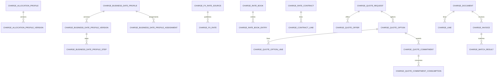

# Database And Persistence

PostgreSQL is the supported runtime database. SQLAlchemy defines the relational model and Alembic is the only supported schema migration path.

## Schema Groups

| Area | Main tables |
| --- | --- |
| Setup and IDs | `charge_management_settings`, `charge_id_sequence` |
| Master data | `charge_component`, `charge_component_alias` |
| Allocation | `charge_allocation_profile`, `charge_allocation_profile_version` |
| Business dates | `charge_business_date_profile`, `charge_business_date_profile_version`, `charge_business_date_profile_step`, `charge_business_date_profile_assignment` |
| FX | `charge_fx_rate_source`, `charge_fx_rate` |
| Pricing | `charge_rate_book`, `charge_rate_book_entry`, `charge_calculation_template`, `charge_calculation_template_step` |
| Contracts and quotes | `charge_rate_contract`, `charge_contract_line`, `charge_quote_request`, `charge_quote_offer`, `charge_quote_option`, `charge_quote_option_line` |
| Execution | `charge_quote_commitment`, `charge_quote_commitment_consumption`, `charge_document`, `charge_line` |
| Reconciliation/export | `charge_invoice`, `charge_match_result`, `charge_export_batch` |

## Key Relationships

The diagram highlights major ownership relationships; inspect `app/db/models.py` and migrations for all optional cross-references and constraints.

## Seed Data

Migrations and repository initialization provide generic settings, common charge components, standard business-date concepts, stable ID sequences, and a `MANUAL` FX source. Seed data is product-neutral and safe to extend through APIs or future migrations.

## FX Semantics

`charge_fx_rate.rate` is directional: target-currency units for one source-currency unit. Uniqueness includes source, currency pair, date, rate type, and conversion method. Resolution defaults to method `DIRECT`, can select the latest prior rate, and can invert the opposite pair when explicitly allowed.

## Concurrency And Operations

- Each HTTP request uses a SQLAlchemy transaction and rolls back on error.
- PostgreSQL repository mutations use a transaction-scoped advisory lock for shared aggregate consistency.
- Use a dedicated database per environment and a dedicated destructive database for tests.
- Apply migrations before starting a new application version.
- Back up PostgreSQL and test restore procedures according to the deployment's recovery objectives.
- Never treat local `.db` files as deployable artifacts; they are ignored by Git.
